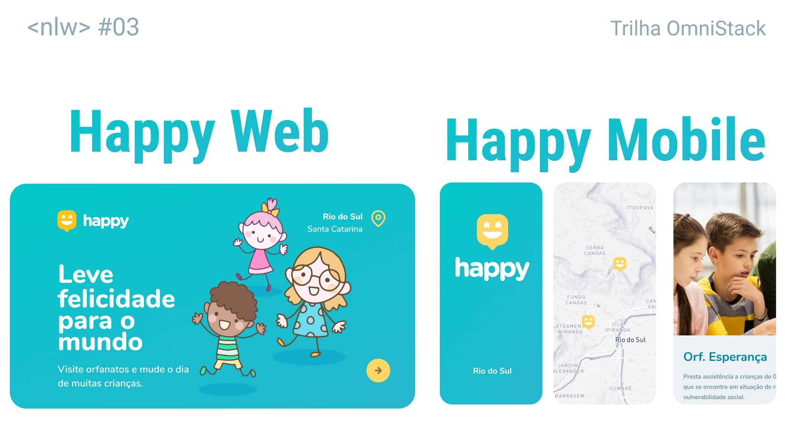
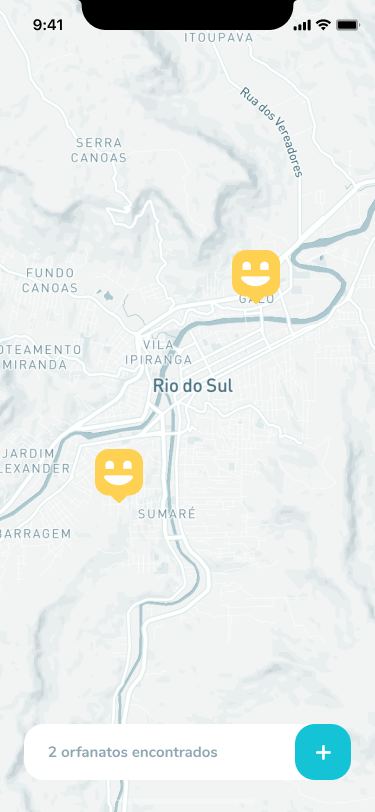
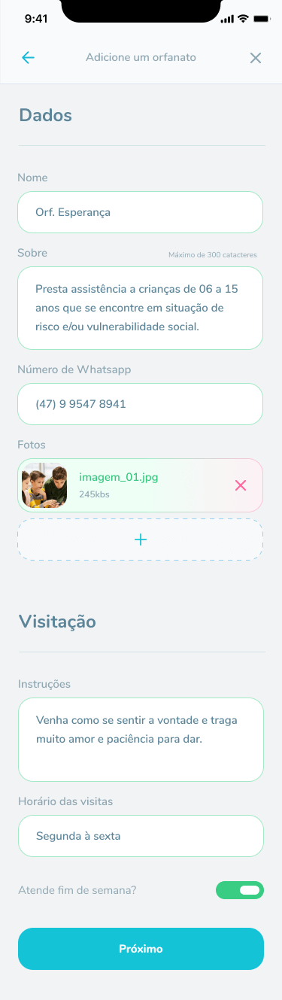
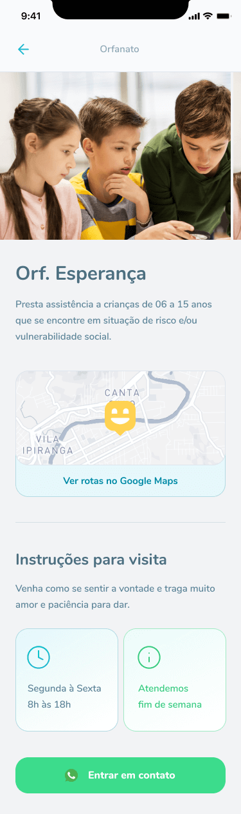
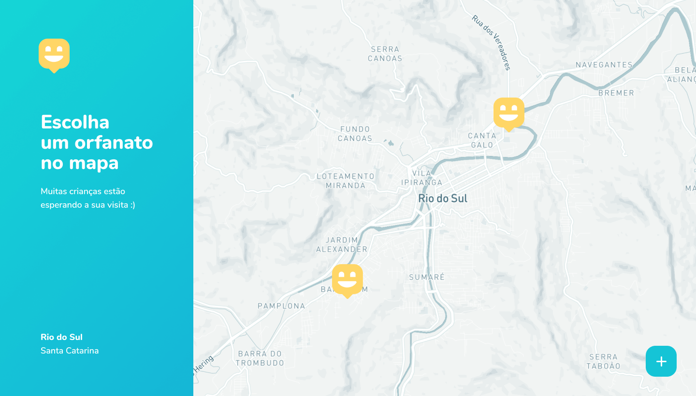
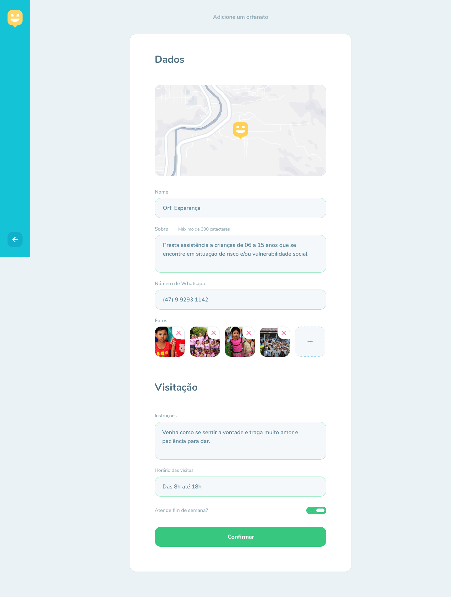

<h1 align="center">
    
</h1>

<h4 align="center"> 
	🚧 NextLevelWeek 3 🚀 Happy
</h4>

<p align="center">
   
   
   
  
  
  
  
  
  
  
</p>

<h1 align="center">
    
</h1>


## 💻 Sobre o projeto

🎈 Happy - é uma forma de conectar as pessoas e orfanatos, para que as pessoas saibam quais orfanatos estão perto delas e o que pode levar, o que não pode levar, se tem que marcar a visita antes ou não tem.

As ongs poderão se cadastrar na plataforma web enviando:
- uma imagem ou mais da ong
- nome da ong, sobre, email e whatsapp
- endereço para que ele possa aparecer no mapa
- informações de visitações:
  - instruções
  - Horário de visita
  - se atende fim de semana

Além de poder cadastrar novas ongs na plataforma web, poderá ser visto as ongs já cadastradas, com todos os detalhes de cadastro citados acima.


Os usuários terão acesso ao aplicativo móvel, onde poderão:
- navegar pelo mapa para ver as ongs cadastradas
- entrar em contato com a ong através do E-mail ou do WhatsApp

Projeto desenvolvido durante a **NLW - Next Level Week** oferecida pela [Rocketseat](rs).


## 🎨 Layout

O layout da aplicação está disponível no Figma.

Plataforma web 💻:
<a href="https://www.figma.com/file/OptvBMOUPVougW4LSO0d2e/Happy-Web-NLW-3">
  
</a>

Plataforma mobile 📱:
<a href="https://www.figma.com/file/zmnUlgtsdYknvfbSWWxSY6/Happy-Mobile-NLW-3">
  
</a>

### Mobile 📱
Tela de localização e cadastro da ong:

<p style="display: flex; align-items: flex-start; justify-content: center;" align="center">
  

  
</p>

Tela de perfil da ong:
<p align="center">
  
</p>

### Web 💻

Tela de localização e cadastro da ong:
<p align="center" style="display: flex; align-items: flex-start; justify-content: center;">
  

  
</p>

Tela de perfil da ong:
<p align="center">  
  
</p>

## 🛠 Tecnologias

As seguintes ferramentas foram usadas na construção do projeto:

- [Expo][expo]
- [Node.js][nodejs]
- [React][reactjs]
- [React Native][rn]
- [TypeScript][typescript]


## 🚀 Como executar o projeto

Podemos considerar este projeto como sendo divido em três partes:
1. Back End (pasta server) 
2. Front End (pasta web)
3. Mobile (pasta mobile)

💡Tanto o Front End quanto o Mobile precisam que o Back End esteja sendo executado para funcionar.

### Pré-requisitos

Antes de começar, você vai precisar ter instalado em sua máquina as seguintes ferramentas:
[Git](https://git-scm.com), [Node.js][nodejs]. 
Além disto é bom ter um editor para trabalhar com o código como [VSCode][vscode]

### 🎲 Rodando o Back End (servidor)

```bash
# Clone este repositório
$ git clone https://github.com/

# acesse a pasta server
$ cd server

# Instale as dependências
$ npm install ou yarn install

# Execute a aplicação em modo de desenvolvimento
$ npm run dev:server ou yarn run dev:server

# O servidor inciará na porta:3333 - acesse http://localhost:3333 
```

### 🧭 Rodando a aplicação web (Front End)

```bash
# Clone este repositório
$ git clone https://github.com/

# Acesse a pasta da aplicação Front End
$ cd web

# Instale as dependências
$ npm install ou yarn install

# Execute a aplicação em modo de desenvolvimento
$ npm run start ou yarn run start

# A aplicação será aberta na porta:3000 - acesse http://localhost:3000
```

### 📱Rodando a aplicação mobile 

```bash
# Clone este repositório
$ git clone https://github.com/

# Acesse a pasta da aplicação Front End
$ cd web

# Instale as dependências
$ npm install ou yarn install

# Execute a aplicação em modo de desenvolvimento
$ npm run start ou yarn run start

# A aplicação será aberta na porta:3000 - acesse http://localhost:3000
```

## 📝 Licença

Este projeto esta sobe a licença MIT.

# Sistema feito apenas para estudos

- Estudo de Node.js, React Js e React Native.
- Estudo realizado junto com a Next Level Week da rocketseat!

# Entrar em contato!

<a href="https://www.linkedin.com/in/lucas-xavier-588b67a6/" target="_blank" >
  
</a>&nbsp;&nbsp;&nbsp;
<a href="mailto:ls.xxavier@gmail.com" target="_blank" >
  
</a> 

Lucas Xavier